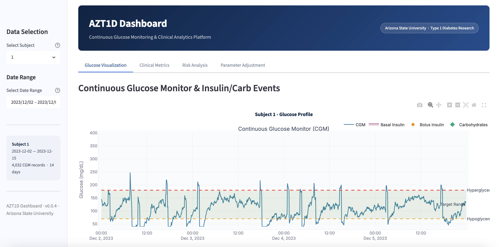
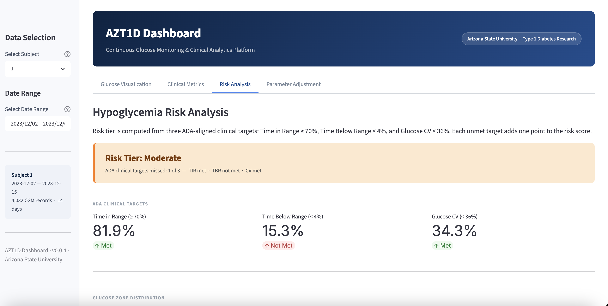
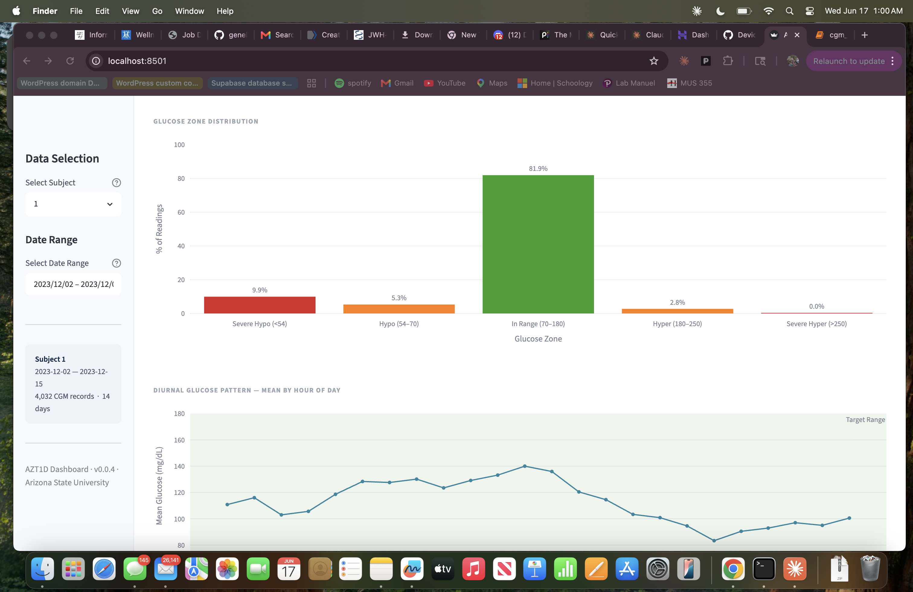
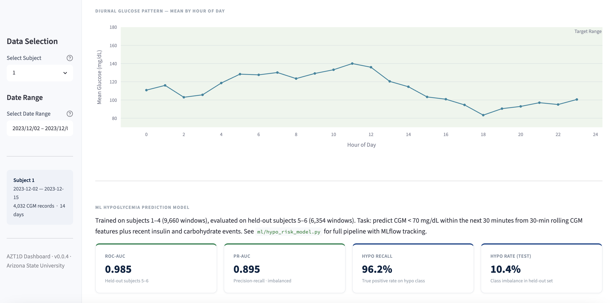
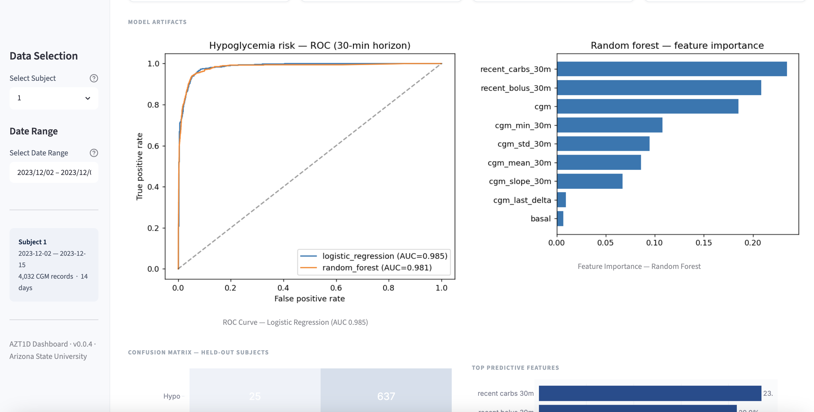
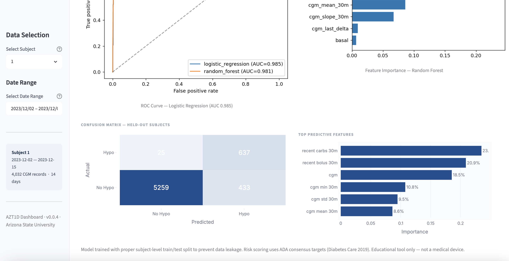
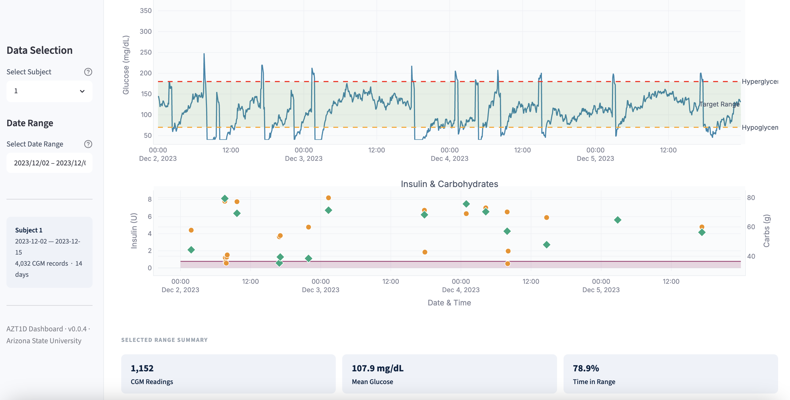

# AZT1D Dashboard — Type 1 Diabetes CGM Analysis Platform

[](https://github.com/genellejenkins1/azt1d-dashboard/actions/workflows/tests.yml)
[](https://azt1d-dashboard-8vk9d6vadwkxjsjbwbgafs.streamlit.app/)
[](https://www.python.org/)
[](LICENSE)

A Python/Streamlit platform for analyzing continuous glucose-monitoring (CGM) data from 25 Type 1 Diabetes patients. Engineered a validated data-loading pipeline with ADA-aligned clinical features, DVC data versioning, and a 49-test suite. The interactive dashboard exposes four tabs: glucose visualization, clinical metrics, risk analysis (ADA goal tracking + ML model results), and counterfactual parameter adjustment. The advanced ML/AI layer covers hypoglycemia-risk modeling (ROC-AUC 0.985 on held-out subjects), SHAP explainability, RAG clinical chatbot, FHIR R4 interoperability, MLflow experiment tracking, SAS analytics, and a Tableau dashboard.

> **Team project — Arizona State University (Naif A. Ganadily, Genelle Jenkins, Toshika Talele).  
> Primary contributions: data pipeline, clinical feature engineering, test suite, and all ML/AI modules.**

---

## Screenshots

**Glucose Visualization tab** — interactive CGM time-series with insulin and carbohydrate overlays:



**Risk Analysis tab** — ADA goal attainment, ML model results (ROC-AUC 0.985), feature importance:



<details>
<summary>More screenshots</summary>







</details>

---

## Live demo

**[azt1d-dashboard-8vk9d6vadwkxjsjbwbgafs.streamlit.app](https://azt1d-dashboard-8vk9d6vadwkxjsjbwbgafs.streamlit.app/)**

Runs entirely on synthetic demo data — real patient CGM data is never deployed. See [`DEPLOY.md`](DEPLOY.md) to host your own instance.

---

## Dashboard tabs

| Tab | What it shows |
|---|---|
| **Glucose Visualization** | Interactive CGM time-series with insulin bolus and carbohydrate overlays; colored target-range bands; selectable date window |
| **Clinical Metrics** | ADA-aligned stat cards (TIR, TBR, TAR, CV, mean glucose) color-coded by goal attainment; full detailed statistics table |
| **Risk Analysis** | ADA goal attainment flags; glucose zone bar chart; diurnal pattern; ML model results — ROC-AUC 0.985, PR-AUC 0.895, confusion matrix, feature importance |
| **Parameter Adjustment** | Counterfactual target-range and CGM-bias explorer — shows how TIR/TBR metrics shift under different reporting conventions |

---

## Repository structure

```
azt1d-dashboard/
├── src/
│   ├── data_loader.py          # Validated CGM loader — ADA clinical features, DVC-backed
│   └── counterfactual.py       # What-if insulin/carb response model
├── tests/
│   ├── test_data_loader.py     # 49-test suite (unit + integration + edge cases)
│   └── test_counterfactual.py
├── ml/
│   ├── hypo_risk_model.py      # Hypoglycemia-risk classifier (scikit-learn + MLflow)
│   ├── forecast_lstm.py        # PyTorch LSTM glucose forecaster vs. persistence baseline
│   ├── shap_explain.py         # SHAP beeswarm + feature importance
│   ├── counterfactual_simulator.py  # Autoregressive what-if simulator
│   ├── llm_summary.py          # LLM clinical-narrative generator (OpenAI/Anthropic)
│   ├── clinical_rag.py         # RAG chatbot — FAISS vector store over patient cohort
│   ├── fhir_export.py          # FHIR R4 Bundle export (LOINC 15074-8)
│   ├── cgm_analysis.sas        # SAS PROC MEANS/FREQ/REG/LOGISTIC clinical analysis
│   ├── generate_synthetic_data.py
│   ├── outputs/                # Real model outputs (PNGs + metrics.json)
│   └── ADVANCED.md
├── notebooks/
│   └── cgm_eda.ipynb           # 22-cell EDA — distributions, TIR, diurnal, outliers
├── tableau/
│   ├── cgm_dashboard.twb       # Tableau Public workbook (open after running export)
│   └── export_for_tableau.py   # Exports patient_summary, timeseries, hypo_events CSVs
├── results/
│   └── fhir/                   # Example FHIR R4 Bundle (502 resources, Subject 1)
├── report/
│   └── cgm_analysis.qmd        # R/Tidyverse + Quarto reproducible report (CI-rendered)
├── sample_data/                # Synthetic demo data (6 subjects — git-tracked)
├── data/raw.dvc                # Real 875MB CGM data — pull via `dvc pull`
├── docs/architecture.md        # Mermaid data-flow diagram
├── app.py                      # Streamlit dashboard — 4 tabs: glucose viz, clinical metrics, risk analysis, counterfactual
├── streamlit_app.py            # Streamlit Cloud deploy entry (generates demo data into data/raw/ first)
├── .github/workflows/
│   ├── tests.yml               # CI — pytest on every push
│   └── render-report.yml       # CI — renders R/Quarto report
└── requirements.txt
```

---

## Installation & quick start

```bash
git clone https://github.com/genellejenkins1/azt1d-dashboard.git
cd azt1d-dashboard
python3 -m venv .venv-azt1d
source .venv-azt1d/bin/activate        # Windows: .venv-azt1d\Scripts\activate
pip install -r requirements.txt

# Option A: run on synthetic demo data (no DVC needed)
python ml/generate_synthetic_data.py --subjects 6 --days 14 --out "sample_data/CGM Records"
streamlit run streamlit_app.py

# Option B: run on real data (requires dataset access)
dvc pull
streamlit run app.py
```

Dashboard opens at `http://localhost:8501`.

---

## ML / AI modules

Run all ML modules on synthetic demo data (no real data required):

```bash
python ml/generate_synthetic_data.py --subjects 6 --days 14 --out "sample_data/CGM Records"
python ml/hypo_risk_model.py          # scikit-learn + MLflow → ml/outputs/
python ml/shap_explain.py             # SHAP beeswarm + importance bar
python ml/counterfactual_simulator.py --subject 1 --bolus-scale 1.3
python ml/llm_summary.py --subject 1  # set OPENAI_API_KEY or ANTHROPIC_API_KEY for live LLM
python ml/forecast_lstm.py --epochs 15
python ml/clinical_rag.py             # RAG over cohort (keyword fallback if faiss not installed)
python ml/fhir_export.py              # → results/fhir/subject_001_cgm_bundle.json
```

MLflow experiment dashboard:
```bash
mlflow ui    # view runs at http://localhost:5000
```

Tableau dashboard:
```bash
python tableau/export_for_tableau.py  # generates CSVs
# then open tableau/cgm_dashboard.twb in Tableau Public
```

SAS analysis:
```bash
# Submit ml/cgm_analysis.sas in SAS Studio (https://odamid.oda.sas.com — free account)
# after running tableau/export_for_tableau.py to generate the input CSVs
```

| Module | Demonstrates |
|---|---|
| `hypo_risk_model.py` | scikit-learn, MLflow, leakage-aware eval, ROC/PR/calibration |
| `forecast_lstm.py` | PyTorch, sequence modeling, LSTM, multivariate time-series |
| `shap_explain.py` | SHAP, model explainability, responsible AI |
| `clinical_rag.py` | RAG, sentence-transformers, FAISS, LLM integration |
| `fhir_export.py` | HL7 FHIR R4, LOINC coding, healthcare interoperability |
| `llm_summary.py` | LLM prompt engineering, OpenAI/Anthropic SDK |
| `cgm_analysis.sas` | SAS PROC MEANS/FREQ/UNIVARIATE/REG/LOGISTIC/SGPLOT |
| `cgm_eda.ipynb` | Pandas, seaborn, Plotly, statistical EDA |
| `cgm_dashboard.twb` | Tableau Public — bar charts, scatter, stacked zones |

---

## Data loading API

```python
from src.data_loader import SubjectDataLoader, load_subject_data

# Single subject
df = load_subject_data(1)

# Cohort
loader = SubjectDataLoader()
df_all = loader.load_multiple_subjects([1, 2, 3])
summary = loader.get_subject_summary(1)
print(f"TIR: {summary['time_in_range']:.1f}%  |  CV: {summary['cv_glucose']:.1f}%")
```

Derived clinical features added automatically (ADA-aligned):

| Feature | Definition |
|---|---|
| `glucose_zone` | severe\_hypo / hypo / in\_range / hyper / severe\_hyper |
| `is_hypoglycemic` | CGM < 70 mg/dL |
| `is_hyperglycemic` | CGM > 180 mg/dL |
| `in_target_range` | 70 ≤ CGM ≤ 180 mg/dL |
| `has_bolus` | insulin bolus delivered |
| `has_carbs` | carbohydrate intake recorded |

---

## Testing

```bash
pytest tests/ -v --cov=src --cov-report=term-missing
```

49 passing tests covering: schema validation, single/multi-subject loading, derived-feature computation, edge cases, error handling, and integration tests with real data. CI runs on every push via GitHub Actions.

---

## Dataset

**AZT1D 2025** — 25 individuals with Type 1 Diabetes, ~38 days each (Dec 2023–Jan 2024), CGM readings every 5 minutes (~11,000 records/subject), 875MB tracked with DVC.

- Real patient data is **not** in this repository (DVC pointer only).
- Synthetic demo data ships in `sample_data/` and is generated by `ml/generate_synthetic_data.py`.
- Subject 14 has a known data gap — the validation pipeline catches and handles it.

---

## Authors

**Naif A. Ganadily · Genelle Jenkins · Toshika Talele**  
Arizona State University, 2025

## License

Apache License 2.0 — see [`LICENSE`](LICENSE).

## Citation

```bibtex
@dataset{azt1d2025,
  title={AZT1D 2025: Real-World Type 1 Diabetes Data from Automated Insulin Delivery Systems},
  author={Naif A. Ganadily and Genelle Jenkins and Toshika Talele},
  year={2025},
  publisher={Arizona State University}
}
```
