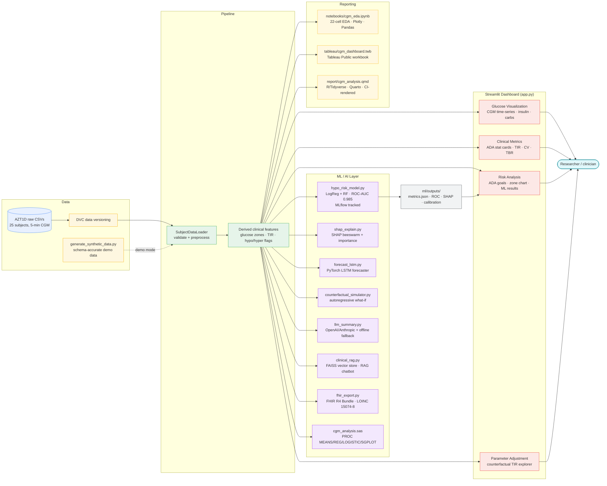

# AZT1D Dashboard — Architecture & Data Flow

## Layers

| Layer | Components | Key technologies |
|---|---|---|
| **Data** | AZT1D raw CSVs + DVC pointer; synthetic generator for demo | DVC, NumPy, Pandas |
| **Pipeline** | `SubjectDataLoader` — schema validation, ADA feature engineering | Pandas, Pytest (49 tests) |
| **Dashboard** | 4-tab Streamlit app — visualization, clinical metrics, risk analysis, counterfactual | Streamlit, Plotly |
| **ML / AI** | Hypo-risk classifier, SHAP, LSTM forecaster, counterfactual simulator, LLM narrative, RAG chatbot, FHIR export, SAS analysis | scikit-learn, PyTorch, SHAP, sentence-transformers, FAISS, MLflow, HL7 FHIR |
| **Reporting** | EDA notebook, Tableau workbook, Quarto/R report (CI-rendered) | Jupyter, Tableau, Quarto, R/Tidyverse |

## Key design decisions

- **Subject-level train/test split** in `hypo_risk_model.py` — subjects 1–4 train, 5–6 test — prevents temporal and cross-subject data leakage.
- **Graceful degradation** throughout: RAG falls back to keyword scoring without FAISS; LLM modules fall back to deterministic templates without an API key; dashboard ML panel loads pre-computed artifacts and shows an info message if they are absent.
- **Real data never deployed** — `data/raw/` is gitignored and DVC-tracked; Streamlit Cloud runs on synthetic demo data only.
- **CI** runs pytest + R/Quarto render on every push via GitHub Actions.
